<body class='typora-export' >

<h1>Masters Thesis - ReadMe</h1><h2>Source of the project</h2>
The Basic Idea of this project is to use an Idea proposed by <a href='https://chenhsuanlin.bitbucket.io/3D-point-cloud-generation/paper.pdf'>Chen-Hsuan Lin et al.</a> to Learn 3d Point-Clouds from Single Image RGB-data. Their approach was split into two steps.
<blockquote><ol start='' ><li>Learning depth-maps of the projected 3d object from multiple viewpoints</li><li>Refining the results by reconstructing the 3d object from the predicted depth information and rendering it from different viewpoints</li></ol></blockquote>
They basically learned 3d representations without a need to store or load the ground truth representation of the objects themselves, and implicitely added constraints directly based on the geometry of the object to a purely two dimensional training process. Since there has been a lot of development on 2d convolution in the past, the first step can be altered to any network architecture that has proven itself over the years.
<h2>1.</h2><blockquote>
<em>All images used are rendered from models in the <a href='https://www.shapenet.org/'>ShapeNet</a> dataset, using the code provided in this repository</em>
</blockquote>
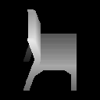

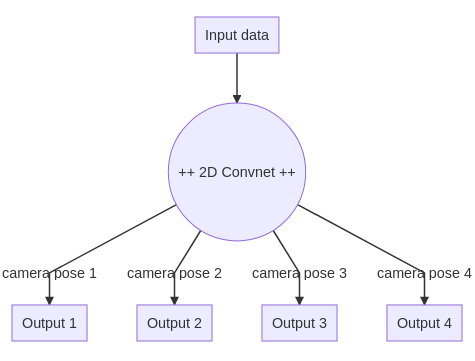

                               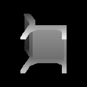 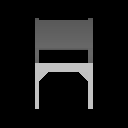 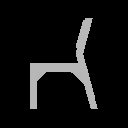 

&nbsp;

For the current use of the concept in this project, depth synthesis is performed instead of estimation of depth from RGB-images. By taking away one of the implicit steps between single-image and multiview-depth, the task of generating 3d objects from projection becomes one of shape completion. The currently implemented network architecture for this step is a basic encoder/decoder structure using learned up- and down-sampling and a low-dimensional latent layer, which makes this project perfectly applicable for usage in GANs. 

The exact specifications of the convnet for the shown examples are:
<figure><table><thead><tr><th>Layer</th><th>#filters</th><th>filter size</th><th>activation</th><th>shape</th></tr></thead><tbody><tr><td>conv_2d</td><td>256</td><td>(3, 3)</td><td>leaky_relu</td><td>(32, 32)</td></tr><tr><td>conv_2d</td><td>512</td><td>(3, 3)</td><td>leaky_relu</td><td>(16, 16)</td></tr><tr><td>conv_2d</td><td>1024</td><td>(3, 3)</td><td>leaky_relu</td><td>(8, 8)</td></tr><tr><td>fully_connected</td><td>4096</td><td>-</td><td>leaky_relu</td><td>(4096)</td></tr><tr><td>fully_connected</td><td>2048</td><td>-</td><td>leaky_relu</td><td>(2048)</td></tr><tr><td>fully_connected</td><td>1024</td><td>-</td><td>leaky_relu</td><td>(1024)</td></tr><tr><td>fully_connected</td><td>2048</td><td>-</td><td>leaky_relu</td><td>(2048)</td></tr><tr><td>fully_connected</td><td>4096</td><td>-</td><td>leaky_relu</td><td>(4096)</td></tr><tr><td>conv_2d_transpose</td><td>1024</td><td>(3, 3)</td><td>leaky_relu</td><td>(8, 8)</td></tr><tr><td>conv_2d_transpose</td><td>512</td><td>(3, 3)</td><td>leaky_relu</td><td>(16, 16)</td></tr><tr><td>conv_2d_transpose</td><td>256</td><td>(3, 3)</td><td>leaky_relu</td><td>(32, 32)</td></tr><tr><td>conv_2d</td><td>128</td><td>(3, 3)</td><td>leaky_relu</td><td>(32, 32)</td></tr><tr><td>conv_2d</td><td>64</td><td>(3, 3)</td><td>leaky_relu</td><td>(32, 32)</td></tr><tr><td>conv_2d</td><td>32</td><td>(3, 3)</td><td>linear</td><td>(32, 32)</td></tr></tbody></table></figure>
The number of output channels (32) are double the chosen number of viewpoints, since masks are learned along the way to refine the rendering process in the second step. Using only this NN, the results on 80% of all chairs in the ShapeNet dataset look like this
<blockquote><ul><li>Examples randomly picked, all available for review</li><li>All predictions are from an evaluation set never seen by the network during training</li></ul></blockquote>

As can be seen, the results of the net itself are close to ground truth on first sight. Yet, when projecting the predicted depth maps into 3d space, the results are subject to noise. The following point-cloud is the result of projection of the left most chairs projected predictions

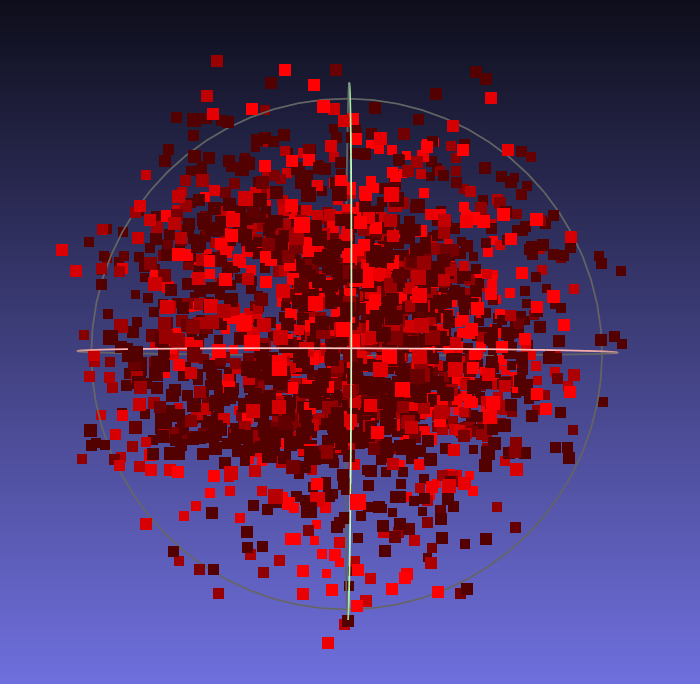
<h2>2.</h2>
Since the aim of the original work and this thesis is to predict 3d point-clouds, and not to transform viewpoints of depth maps, these results are not what is needed. To improve upon the results of step 1, the authors introduced two integral components called &quot;structure generator&quot; and &quot;pseudo renderer&quot;. These two concepts are pointwise orthogonal projection from 2d into 3d space and pointwise orthogonal depth rendering respectively. 

                               

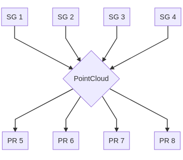

                                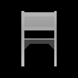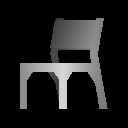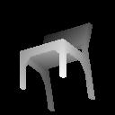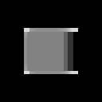

The addition of the structure generator and pseudo rendering steps are completely static and can be added directly after the output layer of the pretrained network. Additionaly, the loss is modified to only penalize depth where the mask predicted a hit while the loss function calculates the loss of the mask as crossentropy. The results after the extension of the net look as follows. 

While the results look worse at first, the back projection of the predicted depth reveals a point cloud that captured the essential details of the model.

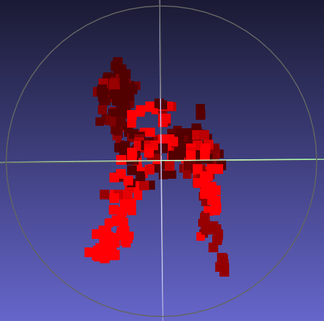

&nbsp;
<h2>Bottlenecks and the main improvement</h2>
While projecting the depth maps predicted in the first step can be easily implemented as matrix-matrix multiplication. In order to render the generated point-cloud, the first problems arise. While the max reduction over every pixel of the output image can be calculated rather quick and without further problems, the <a href='https://www.tensorflow.org/'>TensorFlow </a> <a href='https://www.tensorflow.org/versions/r1.15/api_docs/python/tf/math/reduce_max'>reduce_max function</a> does not provide a gradient. There does not exist a built-in function or quick workaround for this problem, so the authors came up with a combination of scattering the data to a tensor much larger than the output image and pooling the scattered values. 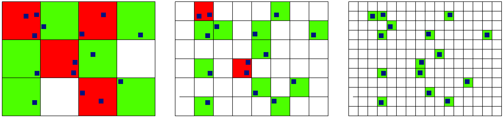                                       <em>Original Resolution (l.), Double Resolution (m.), Quadruple Resolution(r.)</em>

As long as every pixel is only hit once during the scattering process, using max pooling to sample down to the wanted output resolution does not produce any errors. Unfortunately, to generally distribute indexation more evenly, instead of only learning single channel depth values, the x and y indices are learned in the same net as depth and mask and therefore double the memory requirement of the NN itself. Additionaly, the upscale factor described above (U) has to be chosen rather large with at least a value of 30 to 35 to avoid collisions. Therefore the rendering process takes up most of the available memory, while the network has to be  comparably small. 

I developed a strategy to halve the NNs memory consumption and at least thirds of the usage in the pseudo rendering stage.
<h3>1. Reducing channels in the NN</h3>
Instead of learning mask values, depth values, x indices and y indices, the last two are cut to free up memory. This directly affects the scattering process since the number of collisions increases significantly. Since collision is handled by addition by default, and can&#39;t be substituted by more useful operations, another way of handling multiple datapoints for the same pixel had to be found. 
<h3>2. A resourceful scattering scheme for max reducing</h3>
Since the index values are now computed deterministically, we can&#39;t rely on the structure of the data anymore. To solve this issue, I decided to arrange all datapoints in a 6-Tuple [batch index, viewpoint index, x index, y index, z value, mask value]. By sorting these points by multiple columns, a structure can be achieved that clusters x indices related to the same depth map in the same viewpoint while seperating them in the tensor itself. Since sorting data of more than one dimension is not supported by TensorFlow, a workaround has been implemented, that fully supports gradient flow and is therefore applicable for training purposes. 

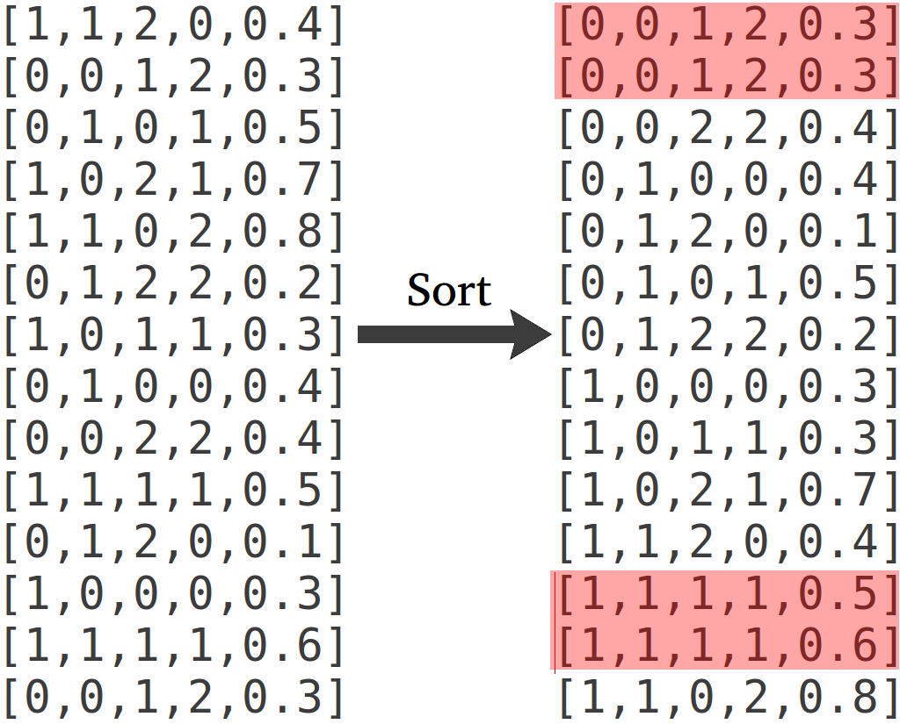

<em>Red marks collisions of indices after sorting by column [3,2,1,0]</em>in the given order

To be able to scatter the sorted data to a dense grid, all rows indices should be unique. To achieve this, the x indices are padded to support up to U&#39; different values per individual output map. This is achieved by multipling the x index tensor by U&#39; and padding between the values. 

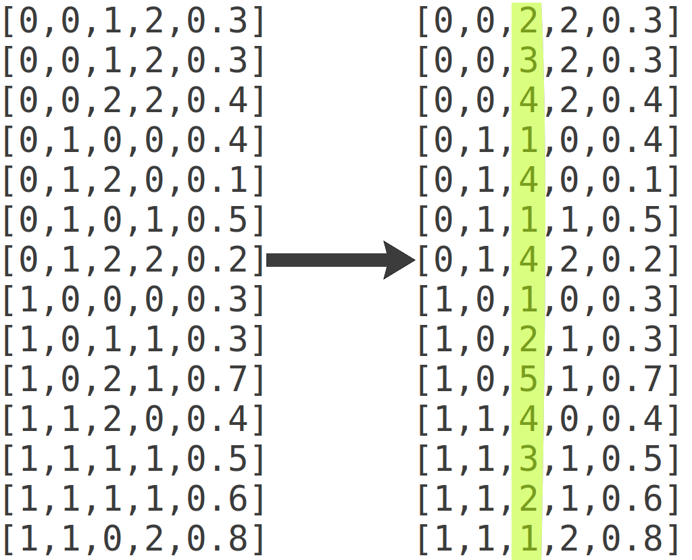

If U&#39; was chosen big enough, all indices are now unique and the data can be scattered to a tensor of shape [dim_x * U&#39;, dim_y] with the advantage, that there need to be more than U&#39; collisions in the original data before any harmful writes can be performed. The original method was based on probability and took a lot more space to perform reliably. For image dimensions of 32x32 the needed value of U&#39; lies well below 100 to perform as well as the old method for U in a range between 30 and 40, which means U² elements per pixel. 

The additional space gained by using this approach can be used to perform on higher image dimensions, which has yet to be tested thoroughly. The preliminary results on 32x32 pixel and under 12 hours of training on a NVIDIA GTX 1070 (8GB RAM)  are more than promising.

</body>
</html>
